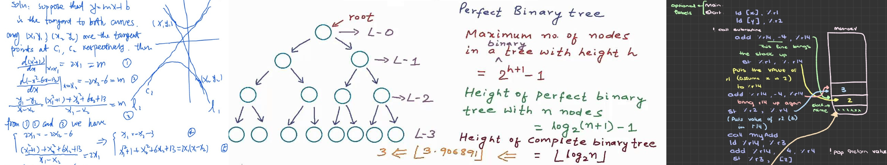

<h1 align="center">Hi I'm Haris Sujethan  </h1>
<h3 align="center">| Tech Advocate 💻 | Computer Science Student 🤓 | Crypto Enthusiast 🌟 |</h3> 
  

I'm Haris Sujethan and I am a Computer Science student based in the GTA 📍. I enjoy learning new skills and working on side projects 🕹️. I have worked on several individual 👤 & group 👥 projects in a professional and academic environment. I'm passionate about my work which you can view in my [GitHub repository](https://github.com/haris-sujethan?tab=repositories)

## About Me

#### • 💻 Previous Role: Software Engineer Intern @ Knobull
#### • 🎓 Ryerson University (TMU) | Computer Science  
#### • 🔭 I’m currently working on a Vehicle Object Detection Project
#### • 📚 Constantly exploring new technologies  
  
## Contact Info

#### • 📧 Contact me through email: Sujethanharis@gmail.com  
#### • 💼 Connect with me through LinkedIn: [Haris Sujethan](https://www.linkedin.com/in/haris-sujethan-3b251921a/)
#### • 🌐 Visit my website: [haris-sujethan.com](https://haris-sujethan.com/)
